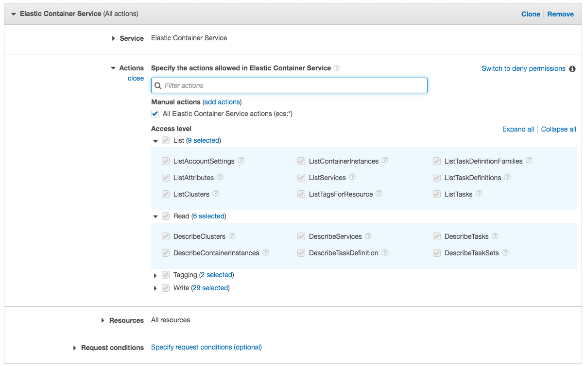

# Solution 1 - admin permission for quick lab execution

Create IAM user for the lab

- IAM -> Users -> Add user -> "ecs_user"
  - Programmatic access -> only this one Yes  
  - Set permissions
    - Attach existing policies directly
      - "AdministratorAccess"

# Solution 2 - try to get precise permission

Setup policy to operate ecs

- IAM -> Policies -> Create policy
  - Service -> select "Elastic Container Service"
  - Actions -> All Elastic Container Service actions (ecs:*)
  - Resources: All
  - Create the name as "Customized_ECS_FullActions"

Create IAM user for the lab

- IAM -> Users -> Add user -> "ecs_lab"
  - Programmatic access -> only this one Yes  
  - Set permissions
    - Attach existing policies directly
      - "AmazonECS_FullAccess"
      - "Customized_ECS_FullActions"
      - "AWSCloudFormationFullAccess"
      - "IAMFullAccess"
      - "AmazonEC2FullAccess"
      - "AmazonVPCFullAccess"
