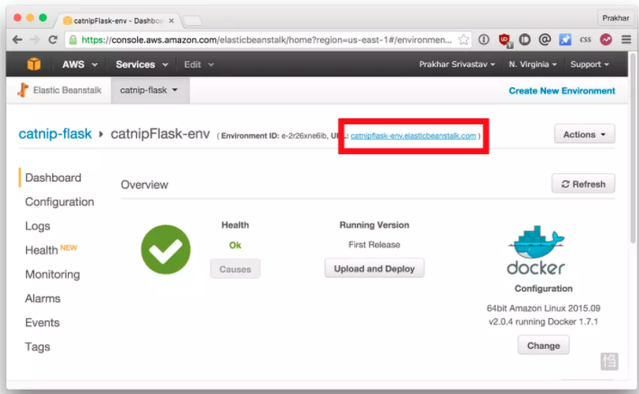

AWS Elastic Beanstalk (EB) is a PaaS (Platform as a Service) offered by AWS. If you've used Heroku, Google App Engine etc. you'll feel right at home. As a developer, you just tell EB how to run your app and it takes care of the rest - including scaling, monitoring and even updates. In April 2014, EB added support for running single-container Docker deployments which is what we'll use to deploy our app. Although EB has a very intuitive CLI, it does require some setup, and to keep things simple we'll use the web UI to launch our application.

# Create

with the configuration of `Dockerrun.aws.json`

# Select Platform and Application code

# Verify

# Clean up - terminate Elastic Beanstalk

